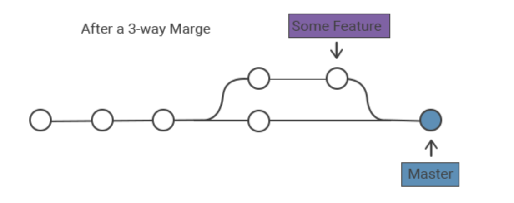

# Expense Tracking System : Assessment Project
- My site is live at = nil

### Details :
- Project : REST API system to store the history of spending (expense) of bank customers
- The system can storage title, amount, note, tags
- The system can add new spending history
- The system can modify the information of spending
- The system can pull out all spending information to show
- The system can retrieve spending information as a list
- Tools = GO, PostgreSQL, Thunder Client, Postman, Docker, React.js, JavaScript, HTML5, CSS3
</br>

### The following HTTP request methods can be used :
- e.POST("/expenses", database.CreateExpensesAllHandler)
- e.GET("/expenses", database.GetExpensesHandler)
- e.GET("/expenses/:id", database.GetExpensesIDHandler)
- e.PUT("/expenses/:id", database.UpdateAllExpensesHandler)
- e.PATCH("/expenses/:id", database.UpdateExpensesHandler)
- e.DELETE("/expenses/:id", database.DeleteExpensesHandler)
</br>

### Structure :
```
📁assessment
│
└── 📁database					= All file HTTP request methods
│	├── 📄create_Integration_test.go	= Integration test (์Not Complete)
│	├── 📄create_test.go			= Unit test (์Not Complete)
│	├── 📄create.go				= e.POST
│	├── 📄database.go			= createTable, DATABASE_URL
│	├── 📄delete.go				= e.DELETE
│	├── 📄get.go				= e.GET
│	├── 📄update_test.go			= Unit test (์Not Complete)
│	├── 📄update.go				= e.PUT, e.PATCH
│	└── 📄user.go				= type struct
│
└── 📁frontend-react				= React.js (์Not Complete)
│   └── 📁...
│       ├── 📄...
│       └── 📄...
│       
└── 📁postman					= For storage postman_environment.json
└── 📄dockerfile						
└── 📄...
└── 📄server.go					= package main
```
<hr>

</br></br></br></br>

## Prerequisites
* โปรเจคตั้งต้นคือ[โปรเจคนี้](https://github.com/KKGo-Software-engineering/assessment)
* กำหนดให้ส่งลิ้งค์คำตอบคือ github repository ที่เก็บโค้ดของคุณ `https://github.com/<your github name>/assessment`
* *MUST* use go module
* *MUST* use PostgreSQL
* *NEED* to create table named `expenses` when start the application if not exist
* *MUST* use go module `go mod init github.com/<your github name>/assessment`
* *MUST* use go 1.18 or above
* api port *MUST* get from environment variable name `PORT` (should be able to config for api start from port `:2565`)
* database url *MUST* get from environment variable name `DATABASE_URL`

## Business Requirements
* Expense tracking system
- ให้สร้างระบบ REST API เพื่อจัดเก็บประวัติการใช้จ่าย (expense) ของลูกค้าธนาคาร ซึ่งความสามารถระบบมีดังนี้
- ระบบสามารถจัดเก็บข้อมูล เรื่อง(title), ยอดค่าใช้จ่าย(amount), บันทึกย่อ(note) และ หมวดหมู่(tags)
- ระบบสามารถเพิ่มประวัติการใช้จ่ายใหม่ได้
- ระบบสามารถปรับเปลี่ยน/แก้ไข ข้อมูลของการใช้จ่ายได้
- ระบบสามารถดึงข้อมูลการใช้จ่ายทั้งหมดออกมาแสดงได้
- ระบบสามารถดึงข้อมูลการใช้จ่ายทีละรายการได้

## User Stories
### Story: EXP01
	* As a user, I want to add a new expense So that I can track my expenses
	* ในฐานะผู้ใช้ ฉันต้องการเพิ่มประวัติการใช้จ่ายใหม่ เพื่อที่จะติดตามประวัติการใช้จ่ายของฉัน
#### Technical Details: EXP01
* POST /expenses
* Request Body
```json
{
	"title": "strawberry smoothie",
	"amount": 79,
	"note": "night market promotion discount 10 bath", 
	"tags": ["food", "beverage"]
}
```
* Response Body
```json
{
	"id": "1",
	"title": "strawberry smoothie",
	"amount": 79,
	"note": "night market promotion discount 10 bath", 
	"tags": ["food", "beverage"]
}
```

### Story: EXP02
	* As a user, I want to see my expense by using expense ID So that I can check my expense information
	* ในฐานะผู้ใช้ ฉันต้องการดูข้อมูลประวัติการใช้จ่ายของฉันโดยใช้รหัสประวัติการใช้จ่าย เพื่อที่จะตรวจสอบข้อมูลประวัติการใช้จ่ายของฉัน
#### Technical Details: EXP02
* GET /expenses/:id
* :id = 1
* Response Body
```json
{
	"id": "1",
	"title": "strawberry smoothie",
	"amount": 79,
	"note": "night market promotion discount 10 bath", 
	"tags": ["food", "beverage"]
}
```


### Story: EXP03
	* As a user, I want to update my expense So that I can correct my expense information
	* ในฐานะผู้ใช้ ฉันต้องการปรับปรุงข้อมูลประวัติการใช้จ่ายของฉัน เพื่อที่จะแก้ไขข้อมูลประวัติการใช้จ่ายของฉัน
#### Technical Details: EXP03
* PUT /expenses/:id
* :id = 1
* Request Body
```json
{
    "title": "apple smoothie",
    "amount": 89,
    "note": "no discount",
    "tags": ["beverage"]
}
```
* Response Body
```json
{
		"id": "1",
		"title": "apple smoothie",
		"amount": 89,
		"note": "no discount",
		"tags": ["beverage"]
}
```

### Story: EXP04
	* As a user, I want to see all my expenses So that I can check my expense information
	* ในฐานะผู้ใช้ ฉันต้องการดูข้อมูลประวัติการใช้จ่ายทั้งหมดของฉัน เพื่อที่จะตรวจสอบข้อมูลประวัติการใช้จ่ายของฉัน
#### Technical Details: EXP04
* GET /expenses
* Response Body
```json
[
	{
		"id": "1",
		"title": "apple smoothie",
		"amount": 89,
		"note": "no discount",
		"tags": ["beverage"]
	},
	{
		"id": "2",
		"title": "iPhone 14 Pro Max 1TB",
		"amount": 66900,
		"note": "birthday gift from my love", 
		"tags": ["gadget"]
	}
]
```

## Technical Requirements
* ใช้ภาษา Go สำหรับการพัฒนา
* ใช้ PostgreSQL สำหรับเก็บข้อมูล
* ใช้ go module สำหรับการจัดการ package
* ใช้ go 1.18 ขึ้นไป
* ":2565" ใช้เป็น port ของ api server
* ชื่อโปรเจคของคุณต้องเป็น *assessment*
* ระบบต้องออกแบบตามมาตรฐาน REST API

  - POST /expenses
  - GET /expenses/:id
  - PUT /expenses/:id
  - GET /expenses

## Hints
- ทำทีละ story โดยเริ่มจาก story แรกแล้วทำเรียงตามลำดับ
- `os.Getenv("PORT")` ใช้เพื่อรับค่า port จาก environment variable
- `os.Getenv("DATABASE_URL")` ใช้เพื่อรับค่า database url จาก environment variable
- เวลารัน `DATABASE_URL=postgres://... PORT=:2565 go run server.go`
- `pq.Array(&tags)` is used to convert []string to postgres array
- script to create table
```sql
	CREATE TABLE IF NOT EXISTS expenses (
		id SERIAL PRIMARY KEY,
		title TEXT,
		amount FLOAT,
		note TEXT,
		tags TEXT[]
	);
```
- example data
```json
{
	"title": "buy a new phone",
	"amount": 39000,
	"note": "buy a new phone",
	"tags": ["gadget", "shopping"]
}
```
- example response
```json
{
	"id": 1,
	"title": "buy a new phone",
	"amount": 39000,
	"note": "buy a new phone",
	"tags": ["gadget", "shopping"]
}
```

## Acceptance Guidelines
* Postman collection สำหรับทดสอบ API ทั้งหมดรันผ่าน
	- หลังจาก import [postman collection](expenses.postman_collection.json) แล้ว อย่าลืมสร้าง postman environment สำหรับเก็บค่าตัวแปรเวลารัน Postman
* กรณี success ต้อง response status code ให้เหมาะสม เช่น
	- 201 StatusCreated
	- 200 StatusOK
* กรณี error ต่างๆ ให้ระบบ response status code ตามความเหมาะสม เช่น
	- 400 StatusBadRequst
	- 500 StatusInternalServerError
* API server ควรจะรองรับ Graceful shutdown
* โปรเจคควรรองรับการ build ด้วย docker โดยใช้ multi-stage build เพื่อสะดวกต่อการ deploy
* มีการเขียน unit test, integration test
	- สำหรับ integration test สามารถเทคนิค docker-compose testing sandbox ที่เรียนในรายวิชา devops สำหรับรัน postgres ได้เพื่อการทดสอบ
* ซอร์สโค้ดควรจัดรูปแบบด้วย gofmt
* ใช้ความรู้ทุกอย่างที่เรียนมาพร้อมด้วยสิ่งที่ศึกษาเพิ่มเติมเอง
* แต่ละ story ควรใช้ branch ของตัวเองแล้ว merge กลับไปที่ main ด้วย 3-way merge


==============================================
